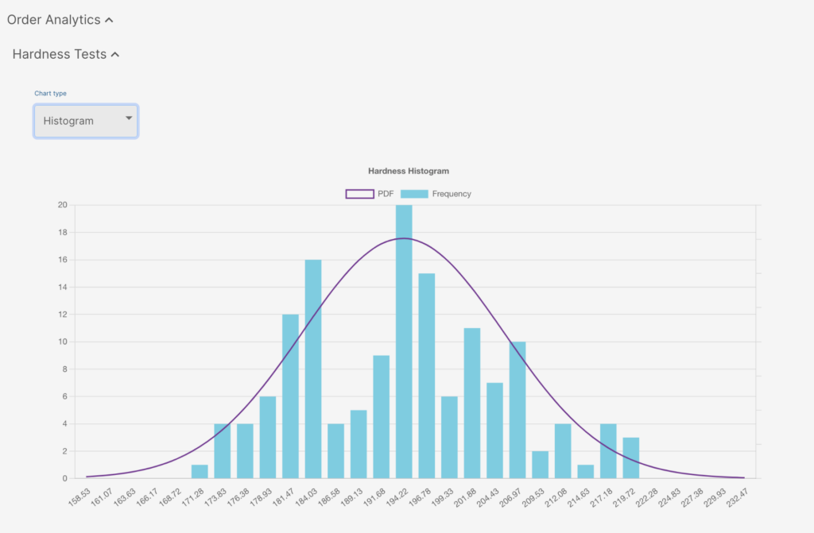
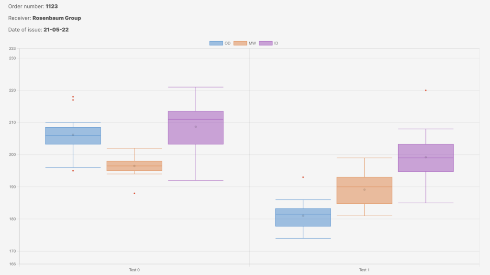

## Why have we introduced them?

Very often, it is assumed that the purchased materials conform to material standards and project specification. However, despite being all compliant to the requirements, they have non-uniform mechanical properties or chemical composition.

Statistics to understand the material properties distribution among the products are extremely useful for both manufacturers and customers, but unfortunately the systems used by manufacturers and customer are unable to produce statistics of material properties distribution due to several reasons (obsolescence, lack of time, lack of knowledge …).

## Why are statistics important?

**For manufacturers:**they allow you to better understand and review the production process, recognize any deviations (current or potential) and make improvements.

**For consumers:**they allow you to see the manufacturer’s supply trend and understand if there have been any changes to the process, or critical areas.

We know very well that it is not physically possible for a material to be fully identical. If the process works “normally”, we expect a Gaussian distribution of the single property (eg hardness), but if we have any deviations or skews it is necessary to investigate further.

Histograms are not used to understand the product (because in fact, we take for granted that if the product is shipped, it is compliant to the requirements), but rather to to understand and improve the production process.

Histogram for hardness values

Box plot for hardness values
